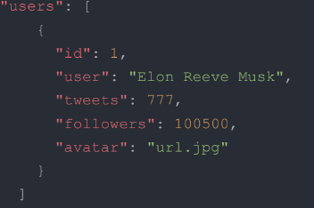

# Task

Create a card for the tweet and add interactivity at the click of a button.

## Render Rulls

1. The layout is fixed in px, semantic and valid.
2. The console doesn't have errors.
3. The task is done using the native Java Script with a module bundler or React.
4. The interactivity works according the technical task.
5. The code is formatted and uncommented.
6. README.dm should be described in the repository.

## Technical task

1. According to the layout must be implemented a user card.
2. After clicking Follow button,
its text changes to "Following" and its color changes too,
and the number of followers increases with yours.
That is, the initial number of followers is 100,500,
and after click on the button it will be 100,501.
3. After updating the page, the final result of the user's should be recorded.
That is, if you click on the button and update the page,
then the button remain in the same state 'Following' with the appropriate color,
and the number of followers doesn't decrease to the initial number.
4. After cliking the button again, its text and color change to the initial state.
Also the number of followers changes, it decreases by 1 (100,500).
5. The number 100,500 must be written with one value (100500) in the code.
The number must be separated by a comma in the user interface.

The link to layout of the user card:
https://www.figma.com/file/zun1oP6NmS2Lmgbcj6e1IG/Test?node-id=0%3A1&t=VoiYTfiXggVItgVd-1.

## Additional task

!!! The task isn't obligated.
To implement the task at will.

1. You may create local database (separate file.json) with next fields:
id, user, tweets, followers, avatar (see the code below).
2. The avavtar images must be written separate url in the attribute 'avatar'.
You may choose them yourself.
3. There should be from 3 to 10 users with different data (at your discretion) in the database.
4. According to the database you need to generate the appropriate number of cards
on the front-end of the application.
5. Each card must be functionally independent of each other.
6. Other requirements are similar to the technical task described above.

### The template of file.json:

# The instructions for working with the downloaded code
## Available Scripts

In the project directory, you can run:
### `npm i`

Install the app base dependencies with the npm install command.
### `npm start`

Runs the app in the development mode.\
Open [http://localhost:3000](http://localhost:3000) to view it in your browser.

The page will reload when you make changes.\
You may also see any lint errors in the console.

### `npm run build`

Builds the app for production to the `build` folder.\
It correctly bundles React in production mode and optimizes the build for the best performance.

The build is minified and the filenames include the hashes.\
Your app is ready to be deployed!

See the section about [deployment](https://facebook.github.io/create-react-app/docs/deployment) for more information.

### `npm run build` fails to minify

This section has moved here: [https://facebook.github.io/create-react-app/docs/troubleshooting#npm-run-build-fails-to-minify](https://facebook.github.io/create-react-app/docs/troubleshooting#npm-run-build-fails-to-minify)
